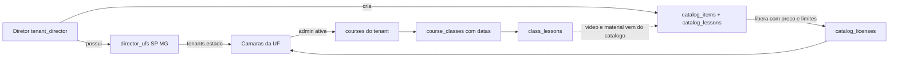

# Plano — Camada Diretor Regional

> Documento de trabalho. Descreve a introdução do papel `tenant_director` no Legiscola: um nível entre o super admin (dono do sistema) e o `tenant_admin` (cliente), com abrangência por **UF** em vez de `tenant_id`, catálogo próprio de cursos/palestras e ciclo comercial de licenciamento.

## Sumário

- [1. Contexto: como o sistema funciona hoje](#1-contexto-como-o-sistema-funciona-hoje)
- [2. O problema que o diretor cria](#2-o-problema-que-o-diretor-cria)
- [3. Decisões tomadas](#3-decisões-tomadas)
- [4. Modelo de dados](#4-modelo-de-dados)
- [5. Área do diretor (`/diretor`)](#5-área-do-diretor-diretor)
- [6. Isolamento e segurança](#6-isolamento-e-segurança)
- [7. Consumo no admin do cliente](#7-consumo-no-admin-do-cliente)
- [8. Ordem de entrega (PRs)](#8-ordem-de-entrega-prs)
- [9. Riscos e pontos de atenção](#9-riscos-e-pontos-de-atenção)
- [10. Em aberto](#10-em-aberto)

---

## 1. Contexto: como o sistema funciona hoje

### Multitenancy

O isolamento é feito por **coluna `tenant_id` + escopo global Eloquent**, não por banco separado.

| Peça | Arquivo | Função |
|---|---|---|
| `TenantContext` | `app/Support/TenantContext.php` | Guarda o `tenant_id` da request (estático) |
| `TenantScope` | `app/Scopes/TenantScope.php` | Global scope: `where tenant_id = contexto`. **Sem contexto, não filtra nada** |
| `BelongsToTenant` | `app/Models/Concerns/BelongsToTenant.php` | Trait em ~50 models; aplica o scope e preenche `tenant_id` no create |
| `SetTenantContext` | `app/Http/Middleware/SetTenantContext.php` | Resolve o tenant por subdomínio (`{slug}.APP_DOMAIN`) ou pelo usuário logado |

Registrado em `bootstrap/app.php` com o alias `tenant`. Aplicado nas rotas de portal, admin, docente e aluno — **não** nas rotas `/central`.

### Papéis

`users.user_type` é um ENUM MySQL e é o gate principal das rotas (middleware `user.type`). Spatie Permission existe em paralelo (roles/permissions), mas **sem teams** — o isolamento não depende dele.

| `user_type` | Quem é | Área |
|---|---|---|
| `super_admin` | Dono do sistema (você) | `/central` |
| `tenant_admin` | Admin/funcionário do cliente | `/admin` |
| `tenant_manager` | Gestor pedagógico | `/docente` |
| `tenant_responsible` | Professor | `/docente` |
| `tenant_user` | Aluno | `/aluno` |

Super admin tem `tenant_id = null` → `TenantContext` fica vazio → vê tudo.

### Domínio acadêmico

```
Course (tenant_id)
  └── CourseClass (turma: datas, vagas, status)
        ├── ClassLesson (aula: título, data, horário, video_url, material)
        │     └── Attendance (presença por aluno/aula)
        ├── Enrollment (matrícula)
        └── Quiz / SatisfactionSurvey
Event (tenant_id) → EventEnrollment  [palestras/eventos, com palestrante e certificado]
```

Pontos relevantes:

- `courses` **sempre** pertence a um tenant. Não existe catálogo global hoje.
- `class_lessons` já tem `video_url`, `material_url`, `material_file_path`. O player só suporta **YouTube** (`app/Support/YoutubeId.php`).
- O único conteúdo verdadeiramente global do sistema hoje é `GlobalPrivacyTerm` (termo LGPD).
- `tenants` **já tem `estado` (UF, 2 chars)** e `cidade` — não precisa criar tabela de região.

### Financeiro hoje

Praticamente inexistente. Só licenciamento manual no tenant: `modulos_plano`, `trial_ends_at`, `subscription_expires_at`, `status`. Sem gateway, sem fatura, sem contrato.

---

## 2. O problema que o diretor cria

O diretor é o **primeiro papel intermediário**: vê vários tenants, mas não todos.

O modelo atual só tem dois extremos — "sou de um tenant" ou "sou super admin e vejo tudo". O `TenantScope` não sabe representar "vejo estes 8 tenants".

Além disso, o carro-chefe (o diretor **cria** um curso e **vende** para o cliente) exige uma entidade de conteúdo que **não pertence a nenhum tenant** até ser licenciada — algo que ainda não existe no schema.

---

## 3. Decisões tomadas

| Pergunta | Decisão |
|---|---|
| Conteúdo liberado é cópia ou referência? | **Híbrido**: cliente recebe cópia da estrutura (edita datas/turmas), mas vídeo e material continuam apontando para o catálogo — corrigiu no catálogo, propaga para todos |
| "Até quantas vezes pode fazer o curso" | Limite de **turmas** que o cliente pode abrir com aquele curso licenciado |
| O catálogo é compartilhado? | **Um catálogo por diretor** — cada diretor só vê e vende o que ele mesmo criou |
| Vídeo | **Link agora** (YouTube/Vimeo), **upload depois** — schema já nasce preparado |
| O que o diretor enxerga do cliente | Agregados **por câmara**: cursos em andamento / concluídos / em inscrição, alunos, matrículas, ranking de cursos. **Sem nome de aluno** |

### As três mudanças estruturais

1. **Abrangência é derivada, não fixa.** Diretor tem N UFs em `director_ufs`; os tenants dele são `tenants where estado in (ufs)`. Cadastrou um cliente novo em SP, o diretor de SP já enxerga — sem vincular manualmente.
2. **O diretor roda sem `TenantContext`.** A área `/diretor` fica no domínio raiz e **não** usa o middleware `tenant`, igual `/central`. Consequência crítica: sem contexto o `TenantScope` não filtra nada, então **toda** leitura de dado de cliente passa por um único serviço que aplica `whereIn('tenant_id', ...)`.
3. **O catálogo é a primeira entidade sem dono de tenant.** `catalog_items` não usa `BelongsToTenant`. Pertence ao diretor (`owner_user_id`) e só vira conteúdo de tenant quando o cliente ativa a licença.

### Fluxo completo



---

## 4. Modelo de dados

### 4.1 Abrangência

**`director_ufs`**

| Coluna | Tipo |
|---|---|
| `id` | bigint PK |
| `user_id` | FK users, cascade |
| `uf` | char(2) |
| `timestamps` | |

Unique `(user_id, uf)`. Índice novo em `tenants.estado`.

> **Pré-requisito:** `tenants.estado` é nullable hoje. Tornar obrigatório no form da Central (`resources/views/central/tenants/includes/_form.blade.php`) e rodar um check dos tenants sem UF **antes** de liberar o papel — cliente sem UF fica invisível para todos os diretores.

### 4.2 Papel

- Novo valor `tenant_director` no ENUM `users.user_type`, seguindo o padrão de `database/migrations/2026_05_10_175000_add_tenant_responsible_to_users_user_type_enum.php` (`ALTER TABLE ... MODIFY COLUMN`).
- `User::TYPE_TENANT_DIRECTOR` + `isTenantDirector()`.
- Role Spatie `tenant_director` (type `central`).

> **Atenção:** **não** adicionar o case em `app/Enums/UserType.php`. Esse enum alimenta o dropdown de criação de usuário do admin do tenant via `options()`; incluir o diretor lá deixaria um `tenant_admin` criar um diretor. O diretor é criado **só na Central**.

### 4.3 Catálogo (por diretor)

**`catalog_items`** — sem `tenant_id`, sem `BelongsToTenant`

| Coluna | Observação |
|---|---|
| `owner_user_id` | FK users — o diretor autor |
| `tipo` | `curso` \| `palestra` |
| `titulo`, `resumo`, `descricao` | |
| `workload_hours` | carga horária |
| `capa_path` | imagem |
| `status` | `rascunho` \| `publicado` \| `arquivado` |
| `preco_sugerido` | decimal(10,2) nullable |
| `softDeletes`, `timestamps` | |

**`catalog_lessons`**

| Coluna | Observação |
|---|---|
| `catalog_item_id` | FK, cascade |
| `ordem` | int |
| `titulo`, `descricao` | |
| `video_provider` | `youtube` \| `vimeo` \| `externo` \| `upload` |
| `video_url` | link (v1) |
| `video_path` | upload (fase 2) |
| `video_duracao_segundos` | nullable |
| `material_url`, `material_file_path`, `material_file_name` | |

> A coluna `video_path` e o valor `upload` já nascem no schema para o upload direto entrar depois sem migration nova.

### 4.4 Licença (a "venda")

**`catalog_licenses`**

| Grupo | Colunas |
|---|---|
| Vínculo | `catalog_item_id`, `tenant_id`, `director_user_id` |
| Contrato | `status` (`rascunho`\|`ativa`\|`suspensa`\|`expirada`\|`cancelada`), `liberado_em`, `exibir_ate`, `max_turmas` (null = ilimitado), `observacoes` |
| Financeiro | `valor`, `pagamento_status` (`pendente`\|`parcial`\|`pago`\|`isento`\|`cancelado`), `vencimento_em`, `pago_em`, `forma_pagamento` |
| Nota fiscal | `nota_fiscal_numero`, `nota_fiscal_emitida_em`, `nota_fiscal_arquivo_path` |

O financeiro fica nas colunas da própria licença (controle básico). Se depois surgir parcelamento ou renovação anual, entra uma `catalog_license_payments` sem quebrar nada.

### 4.5 Ligação com o domínio existente

Colunas nullable novas:

- `courses.catalog_item_id`, `courses.catalog_license_id`
- `class_lessons.catalog_lesson_id`
- `events.catalog_item_id`, `events.catalog_license_id`

**Como o híbrido funciona na prática:**

Ao criar uma turma de um curso do catálogo, o sistema **copia a estrutura** de aulas (título, ordem) para `class_lessons`, guardando `catalog_lesson_id`. O cliente edita data, horário e título.

Vídeo e material **não são copiados** — um accessor em `ClassLesson` resolve o valor do catálogo quando `catalog_lesson_id` existe, e o formulário do admin mostra esses campos bloqueados com o rótulo "conteúdo do catálogo".

Resultado: corrigir um vídeo no catálogo propaga para todos os clientes na hora, sem migration nem job.

---

## 5. Área do diretor (`/diretor`)

Novo `routes/modules/director.php`:

- Prefixo `/diretor`, nome `diretor.`
- Middleware `['auth','verified','accepted-privacy-term','director-access','user.type:tenant_director']`
- **Sem** o alias `tenant` — espelhando `routes/modules/central.php`

Ajustes em `bootstrap/app.php`:

- Alias `director-access` → `EnsureDirectorAccess`
- Branch de `redirectGuestsTo` para `/diretor/*`
- Branch de `redirectUsersTo` para `isTenantDirector()`

Login em `/login/diretor`, espelhando `CentralAuthController` (mesmo guard `web`, valida `user_type` + role Spatie).

### Telas

| Tela | Conteúdo |
|---|---|
| **Panorama** | Cards por UF e, dentro, uma linha por câmara: cursos em andamento, concluídos, em inscrição, total de alunos, matrículas do período, ranking de cursos por matrículas. Sem nome de aluno |
| **Cliente (ficha da câmara)** | Os mesmos agregados no detalhe + licenças ativas + situação financeira daquele cliente |
| **Catálogo** | CRUD de itens e aulas, com preview do vídeo |
| **Licenças** | Liberar item para cliente, definir valor, `max_turmas`, `exibir_ate`; acompanhar pagamento e nota |
| **Financeiro** | Recebíveis por status e por mês, filtrável por UF e cliente |

> Sobre "cursos mais acessados": não existe tracking de acesso hoje. O v1 usa **matrículas e conclusões** como métrica. Uma tabela `course_class_views` pode entrar depois se você quiser acesso real.

---

## 6. Isolamento e segurança

Este é o ponto mais sensível do plano. Como a área do diretor roda **sem** `TenantContext`, o `TenantScope` não protege nada — um `Course::count()` solto retornaria os cursos de **todos** os clientes do sistema.

| Peça | Responsabilidade |
|---|---|
| `App\Support\DirectorContext::tenantIds()` | Resolve e memoiza os tenants do diretor na request |
| `App\Http\Middleware\EnsureDirectorAccess` | Exige `tenant_director` e pelo menos uma UF |
| `App\Services\DirectorInsightsService` | **Única** porta de entrada para dado de cliente; todo método aplica `whereIn('tenant_id', DirectorContext::tenantIds())` |
| `CatalogItemPolicy` | `owner_user_id === user->id` |
| `CatalogLicensePolicy` | Tenant da licença dentro da abrangência do diretor |

**Teste obrigatório:** diretor de SP recebe 403 ou lista vazia para tenant de MG, em cada rota da área. Sem esse teste, o recurso não sobe.

---

## 7. Consumo no admin do cliente

Nova seção em `/admin/escola` listando as licenças ativas do tenant.

O admin clica em **"Ativar no meu portal"**:

1. Cria o `Course` no tenant, com `catalog_item_id` e `catalog_license_id` preenchidos
2. Leva direto para a criação da turma, onde ele define datas de início/fim e janela de inscrição
3. As aulas são geradas a partir de `catalog_lessons`, com `catalog_lesson_id` preenchido

Reaproveita o hub de turma já construído em `resources/views/admin/course-classes/show.blade.php`.

### Regras aplicadas

- Bloquear nova turma quando `count(course_classes) >= max_turmas`
- Ocultar curso e turmas do portal após `exibir_ate`

**Palestra** segue o mesmo caminho, mas materializa um `Event` em vez de `Course` + turma.

---

## 8. Ordem de entrega (PRs)

Sete PRs pequenos, cada um utilizável isoladamente. Os três primeiros já entregam o painel de acompanhamento; o carro-chefe (catálogo vendido e consumido) fecha no PR 4.

| # | Escopo | Entrega |
|---|---|---|
| 1 | Papel + abrangência | ENUM `tenant_director`, `isTenantDirector()`, role Spatie, `director_ufs`, índice em `tenants.estado`, UF obrigatória no form da Central |
| 2 | Área `/diretor` | `routes/modules/director.php`, `EnsureDirectorAccess`, `DirectorContext`, login `/login/diretor`, aliases e redirects, layout com sidebar |
| 3 | Panorama | `DirectorInsightsService` com filtro `whereIn`, telas de panorama por UF e ficha do cliente, testes de isolamento SP vs MG |
| 4 | Catálogo | `catalog_items` + `catalog_lessons`, models sem `BelongsToTenant`, CRUD de item e aulas com vídeo por link |
| 5 | Licenças | `catalog_licenses`, liberar item para cliente da UF, `max_turmas`, `exibir_ate`, `CatalogLicensePolicy` |
| 6 | Consumo no tenant | Listar licenças ativas no admin, ativar criando `Course`, gerar `class_lessons` com `catalog_lesson_id`, accessor de vídeo/material, enforcement dos limites |
| 7 | Financeiro | Bloco financeiro da licença e painel de recebíveis por UF, cliente e mês |
| 8 | Palestras | Itens tipo `palestra` materializando `Event` no tenant |

---

## 9. Riscos e pontos de atenção

1. **Vazamento entre tenants.** O maior risco do plano. Mitigação: serviço único + teste de isolamento obrigatório em todas as rotas.
2. **Tenants sem UF.** Ficam invisíveis para qualquer diretor. Fazer o backfill antes de liberar o papel.
3. **`app/Enums/UserType.php`.** Não incluir o diretor lá, ou um `tenant_admin` conseguirá criar diretores pelo painel dele.
4. **Dívida técnica pré-existente.** O `AuthServiceProvider` registra policies para models que não existem mais (`Cnae`, `EmpresaRelacao`, etc.), resíduo do fork DesenvolveCity. Não bloqueia este plano, mas vale limpar em paralelo.
5. **Nome do papel.** No banco fica `tenant_director` (inglês, alinhado com `tenant_admin`/`tenant_manager`); nas telas aparece "Diretor Regional".

---

## 10. Em aberto

Você quer que o **super admin** também veja e administre o catálogo e o financeiro de todos os diretores (relatório consolidado na Central)?

Não está no escopo acima. Se sim, entra como um PR 9 curto reaproveitando o mesmo serviço sem o filtro de UF.
